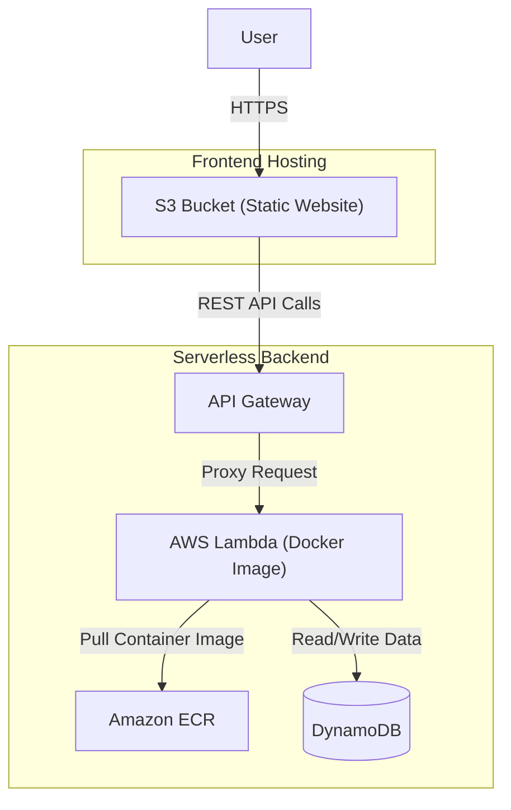
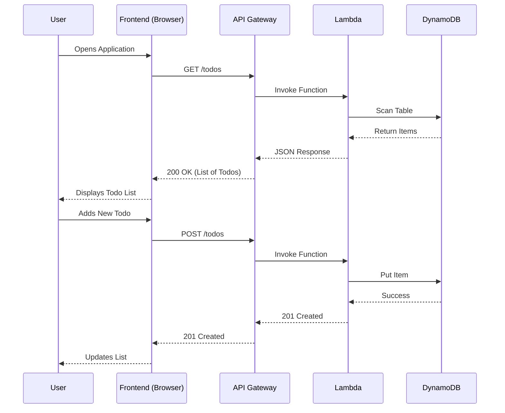

# Fullstack Todo List Application

A robust, serverless Todo List application built with a React frontend and a Node.js Express backend, fully deployed on AWS using Infrastructure as Code (IaC).

## 📖 Project Overview

This project demonstrates a modern, cloud-native approach to building web applications. It separates concerns between a static frontend, a containerized serverless backend, and managed database services.

**Key Features:**
*   **Create, Read, Update, Delete (CRUD)** operations for Todo items.
*   **Responsive Design** for mobile and desktop.
*   **Serverless Architecture** for zero-maintenance scaling.
*   **Infrastructure as Code** for reproducible deployments.

## 🏗 Architecture & Infrastructure

The application utilizes a serverless architecture on AWS.

### Infrastructure Diagram



### Component Breakdown

#### 1. Frontend (`/frontend`)
*   **Tech Stack**: React 19, Vite, TypeScript, Tailwind CSS 4.
*   **Hosting**: Hosted as a static website on **Amazon S3**.
*   **Functionality**:
    *   Fetches data from the backend via REST API.
    *   Uses **Axios** for HTTP requests.
    *   Styled with **Tailwind CSS** for a modern, clean look.
    *   Uses **Lucide React** for icons.

#### 2. Backend (`/backend`)
*   **Tech Stack**: Node.js, Express 5, TypeScript.
*   **Compute**: Runs on **AWS Lambda** using a custom Docker container image.
*   **Storage**: Stores data in **Amazon DynamoDB**.
*   **Containerization**:
    *   Packaged using **Docker**.
    *   Stored in **Amazon Elastic Container Registry (ECR)**.
    *   Uses the `aws-lambda-adapter` to allow standard Express apps to run on Lambda without code changes.

#### 3. Infrastructure (`/infrastructure`)
*   **Tech Stack**: Terraform & Terragrunt.
*   **Modules**:
    *   **S3**: Hosts the frontend assets.
    *   **API Gateway**: Exposes the Lambda function as a public HTTP endpoint.
    *   **Lambda**: Executes the backend logic.
    *   **DynamoDB**: NoSQL database for storing todos.
    *   **ECR**: Registry for the backend Docker image.
    *   **IAM**: Manages permissions and roles for secure access between services.

## 🔄 How It Works (Request Flow)

Here is the flow of data when a user interacts with the application:



## 🚀 Getting Started

### Prerequisites

-   **Node.js** (v18+)
-   **Docker** (Running)
-   **AWS CLI** (Configured)
-   **Terraform** & **Terragrunt**

### 💻 Local Development

#### Option A: Run Full Stack (Production Preview)
Run the entire application in containers as it would run in production.
**Note**: This mode does **not** support hot reloading. Use Option B for development.

```bash
docker compose -f docker-compose-build.yml up -d --build
```
- **Frontend**: [http://localhost:3000](http://localhost:3000)
- **Backend**: [http://localhost:3001](http://localhost:3001)

#### Option B: Local Development (Hot Reloading)
Use this method for active development. It runs the services locally with hot-reloading enabled, allowing you to see changes immediately.

1.  **Start Database**:
    Start the local DynamoDB instance.
    ```bash
    docker compose -f docker-compose-dynamodb.yml up -d
    ```

2.  **Start Backend**:
    Navigate to the backend directory, install dependencies, and start the server.
    ```bash
    cd backend
    npm install
    cp .env.example .env
    npm run dev
    ```

3.  **Start Frontend**:
    Navigate to the frontend directory, install dependencies, and start the development server.
    ```bash
    cd frontend
    npm install
    npm run dev
    ```

### ☁️ AWS Deployment

For detailed deployment instructions, please refer to [DEPLOYMENT.md](./DEPLOYMENT.md).

**Quick Summary:**
1.  **Infrastructure**: Provision resources using Terragrunt.
    ```bash
    cd infrastructure/environments/dev
    terragrunt apply
    ```
2.  **Backend**: Deploy the backend code.
    ```bash
    ./deploy_backend.sh
    ```
3.  **Frontend**: Build the React application and sync the static files to the provisioned S3 bucket.
